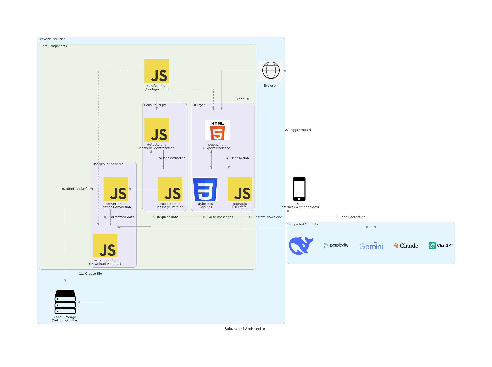
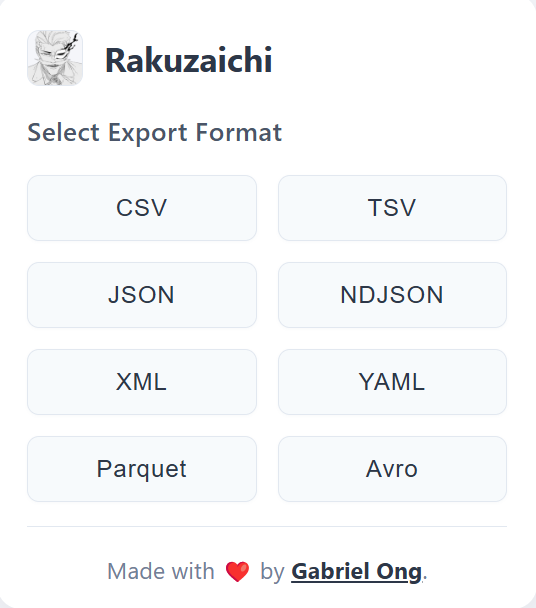
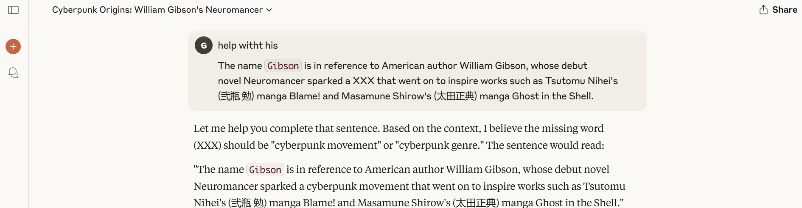
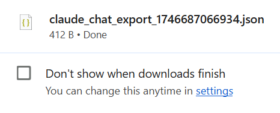

[](https://github.com/gongahkia/rakuzaichi/releases/tag/1.0.0) 

# `Rakuzaichi`

Browser extension that stores your chats with [LLMs](https://cloud.google.com/ai/llms) locally, for the future.

## Stack

* *Frontend*: HTML, CSS
* *Backend*: JavaScript

## Rationale

As [AI chatbots](https://cloud.google.com/use-cases/ai-chatbot) become an everyday tool, being able to [store local copies](https://www.reddit.com/r/cybersecurity_help/comments/1ae6vzk/cloud_vs_local_storage/) of your past chat logs becomes increasingly important.

Unfortunately, current chatbots only support exporting chat history as `.pdf`, `.md` or `.docx` *(if at all)*.

`Rakuzaichi` puts you ***back in control*** of your data by [exporting your chat history](#screenshots) *(and other useful metadata)* at the click of a button in the following formats, with a focus on serialisation, transfer and storage.

| Export Format | Purpose |
| :--- | :--- |
| [CSV](https://en.wikipedia.org/wiki/Comma-separated_values) | Wide support for tabular data and spreadsheet operations|
| [TSV](https://en.wikipedia.org/wiki/Tab-separated_values) | Tab-delimited CSV alternative for ease of parsing and storage|
| [JSON](https://en.wikipedia.org/wiki/JSON) | Human-readable and universally supported storage format|
| [NDJSON](https://en.wikipedia.org/wiki/JSON_streaming#Compatibility) | JSON optimised for streaming and large datasets |
| [XML](https://en.wikipedia.org/wiki/XML) | Extensible and hierarchy-capable for legacy and enterprise |
| [YAML](https://en.wikipedia.org/wiki/YAML) | Human-readable storage for configuration files |
| [Parquet](https://parquet.apache.org/) *(Apache)* | Columnar storage for big data analytics |
| [Avro](https://avro.apache.org/) *(Apache)* | Compact binary format with native serialization capabilities |

See the supported chatbots [here](#chatbot-coverage).

## Architecture



## Screenshots

### Browser Extension



### Exporting a chat



<br>

<div style="display: flex; justify-content: space-between;">
  
  
</div>

## Usage

> [!IMPORTANT]  
> Read the [legal disclaimer](#legal-disclaimer) before using `Rakuzaichi`.  

1. Clone the repository.

```console
$ git clone https://github.com/gongahkia/rakuzaichi
```

Then follow the below instructions for your browser.

### Firefox

1. Copy and paste this link in the search bar *about:debugging#/runtime/this-firefox*.
2. Click *load temporary add-on*.
3. Open the `Rakuzaichi` repo, select `manifest.json`.
4. Click the toggle button to open the `Rakuzaichi` browser extension.

### Chrome

1. Copy and paste this link in the search bar *chrome://extensions/*.
2. Toggle *Developer mode* on.
3. Click *load unpacked*.
4. Open the `Rakuzaichi` repo, click *select*.
5. Click the toggle button to open the `Rakuzaichi` browser extension.

Support for other browsers like Opera, Vivaldi have not been extensively tested, but this extension should work. Open an issue for further support.

## Chatbot Coverage

| Chatbot | Status |
| :--- | :--- |
| [ChatGPT](https://chatgpt.com/) |  |
| [Gemini](https://gemini.google.com/) |  |
| [Claude](https://claude.ai/) |  |
| [Perplexity](https://www.perplexity.ai/) |  |
| [DeepSeek](https://chat.deepseek.com/) |  |
| [Grok](https://grok.com/) |  |
| [Copilot](https://copilot.microsoft.com/) |  |

## Reference

The name `Rakuzaichi` is in reference to the [Rakuzaichi Auction House](https://kagurabachi.fandom.com/wiki/Rakuzaichi_Auction_House) (楽座市) owned by the [Sazanami Clan](https://kagurabachi.fandom.com/wiki/Sazanami_Clan) (漣家 ), the main setting for the [Rakuzaichi Arc](https://kagurabachi.fandom.com/wiki/Rakuzaichi_Arc) of the ongoing manga series [Kagurabachi](https://kagurabachi.fandom.com/wiki/Kagurabachi_Wiki).


## Legal disclaimer

The Rakuzaichi browser extension ("Rakuzaichi") is provided "AS IS" and "AS AVAILABLE," without warranty of any kind, express or implied. By using Rakuzaichi, you acknowledge that you have read, understood, and agree to be bound by this disclaimer's below terms and limitations.

### No Responsibility Disclaimer

The information and functionality provided by Rakuzaichi through its chat export services is for general informational purposes only. Rakuzaichi and its creators make no representation or warranty of any kind, express or implied, regarding the accuracy, adequacy, validity, reliability, availability, or completeness of any data exported through the extension.

### Use at Your Own Risk

Your use of Rakuzaichi and its features is entirely at your own risk. Rakuzaichi's creators and contributors shall not be liable for any errors or omissions in the exported content, nor for any actions taken in reliance thereon.

### Export Functionality Limitations

Data exported by Rakuzaichi in JSON, YAML, Parquet, XML, CSV, or other formats may contain limitations, inconsistencies, or formatting issues. Users should:
* Not rely solely on exported chat data for critical decisions
* Verify all information against the original chat interfaces
* Understand that format conversion may result in partial data loss or transformation
* Be aware that exported data may not include all metadata from the original chat platform

### No Technical Support Guarantee

Rakuzaichi does not guarantee technical support or compatibility with all AI chatbot platforms. The extension's functionality may change based on updates to the underlying platforms it interacts with. Users should be aware that changes to third-party chat interfaces may temporarily or permanently affect Rakuzaichi's functionality.

### Intellectual Property

Users are responsible for ensuring they have the necessary rights to export and use chat conversations processed through Rakuzaichi. The extension does not claim ownership of user-accessed content, but users grant Rakuzaichi the right to process and convert such content for the purpose of providing export services.

### Third-Party Services

Rakuzaichi interacts with third-party services including but not limited to various AI chatbot platforms. The use of these services is subject to their respective terms and conditions. Rakuzaichi's creators are not responsible for the performance, availability, or policies of these third-party services.

### Data Privacy

Information processed through Rakuzaichi may be temporarily handled within the extension's operation. By using Rakuzaichi, you acknowledge that:
* The extension processes conversation data that may contain personal information
* You have the right to export the data you're accessing
* Exported data becomes your responsibility to store and handle securely
* Users should review the terms of service of the original chat platforms regarding data export permissions

### Limitation of Liability

Under no circumstances shall Rakuzaichi's creators or contributors be liable for any indirect, incidental, special, consequential, or punitive damages resulting from your use of or inability to use the extension. Rakuzaichi is not liable for any decisions made or actions taken based on the exported data provided.

### Compliance with Terms of Service

Users are responsible for ensuring their use of Rakuzaichi complies with the terms of service of the AI chat platforms from which they export data. Rakuzaichi does not encourage or support circumventing any restrictions placed by these platforms.

### Changes to Disclaimer

This disclaimer may be updated from time to time without notice. It is your responsibility to review this disclaimer periodically for changes.

### Termination of Service

Rakuzaichi reserves the right to modify, suspend, or discontinue the extension or any part thereof at any time without prior notice or liability.