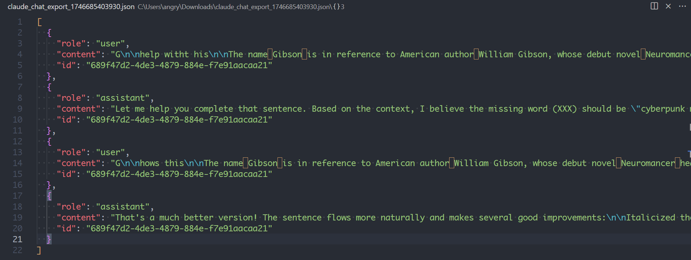

[](https://github.com/gongahkia/rakuzaichi/releases/tag/1.0.0) 

# `Rakuzaichi`

...

## Rationale

...

## Stack

* *Frontend*: HTML, CSS
* *Backend*: JavaScript

## Screenshots

<div style="display: flex; justify-content: space-between;">
  
  
</div>

<br>

<div style="display: flex; justify-content: space-between;">
  
  
</div>

<br>

<div style="display: flex; justify-content: space-between;">
  
  
</div>

## Architecture


## Usage

> [!IMPORTANT]  
> Read the [legal disclaimer](#legal-disclaimer) before using `Rakuzaichi`.  

1. Clone the repository.

```console
$ git clone https://github.com/gongahkia/rakuzaichi
```

Then follow the below instructions for your browser.

### Firefox

1. Copy and paste this link in the search bar *about:debugging#/runtime/this-firefox*.
2. Click *load temporary add-on*.
3. Open the `Rakuzaichi` repo, select `manifest.json`.
4. Click the toggle button to open the `Rakuzaichi` browser extension.
5. Input your Gemeni API Key and *Save*.

### Chrome

1. Copy and paste this link in the search bar *chrome://extensions/*.
2. Toggle *Developer mode* on.
3. Click *load unpacked*.
4. Open the `Rakuzaichi` repo, click *select*.
5. Click the toggle button to open the `Rakuzaichi` browser extension.
6. Input your Gemeni API Key and *Save*.

Support for other browsers like Opera, Vivaldi have not been extensively tested, but this extension should work. Open an issue for further support.

## Reference

The name `Rakuzaichi` is in reference to the [Rakuzaichi Auction House](https://kagurabachi.fandom.com/wiki/Rakuzaichi_Auction_House) (楽座市) owned by the [Sazanami Clan](https://kagurabachi.fandom.com/wiki/Sazanami_Clan) (漣家 ), the main setting for the [Rakuzaichi Arc](https://kagurabachi.fandom.com/wiki/Rakuzaichi_Arc) of the ongoing manga series [Kagurabachi](https://kagurabachi.fandom.com/wiki/Kagurabachi_Wiki).


## Legal disclaimer

